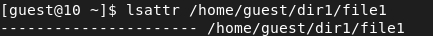

---
# Front matter
lang: ru-RU
title: Защита лабораторной работы №4. Дискреционное разгарничение прав в Linux. Расширенные атрибуты 
author: "Бурдина Ксения Павловна"
group: NFIbd-01-19
institute: RUDN University, Moscow, Russian Federation
date: 2022 Sep 27th

# Formatting
toc: false
slide_level: 2
header-includes: 
 - \metroset{progressbar=frametitle,sectionpage=progressbar,numbering=fraction}
 - '\makeatletter'
 - '\beamer@ignorenonframefalse'
 - '\makeatother'
aspectratio: 43
section-titles: true
theme: metropolis

---

# Результат выполнения лабораторной работы №4

# Цель выполнения лабораторной работы 

## Цель выполнения лабораторной работы

Получение практических навыков работы в консоли с расширенными атрибутами файлов.

# Результат выполнения лабораторной работы

## Результат выполнения лабораторной работы

Определение расширенных атрибутов файла file1:

## Результат выполнения лабораторной работы

Установка на файл прав на чтение и запись:

## Результат выполнения лабораторной работы

Попытка установки на файл file1 расширенного атрибута *a*:

## Результат выполнения лабораторной работы

Установка расширенного атрибута *a* от имени суперпользователя:

## Результат выполнения лабораторной работы

Проверка правильности установления атрибута:

## Результат выполнения лабораторной работы

Дозапись и чтение файла file1:

## Результат выполнения лабораторной работы

Попытка удаления файла, изменения имеющейся в нём информации и его переименования:

{width=90%}

## Результат выполнения лабораторной работы

Попытка изменения атрибутов файла:

## Результат выполнения лабораторной работы

Снятие расширенного атрибута *a* с файла и проверка его снятия:

{width=90%}

{width=90%}

## Результат выполнения лабораторной работы

Повтор неудавшихся операций:

{width=60%}

{width=60%}

## Результат выполнения лабораторной работы

Установка атрибута *i*:

## Результат выполнения лабораторной работы

Выполнение операций с файлом file1 с атрибутом *i*:

{width=80%}

## Результат выполнения лабораторной работы

Снятие атрибута *i* и проверка доступности действий с файлом:

{width=60%}

# Выводы

## Выводы

1. Повысили свои навыки использования интерфейса командой строки (CLI).

2. Познакомились на примерах с тем, как используются основные и расширенные атрибуты при разграничении доступа.

3. Связали теорию дискреционного разделения доступа с её реализацией на практике в ОС Linux.

4. Опробовали действие на практике расширенных атрибутов *a* и *i*.
