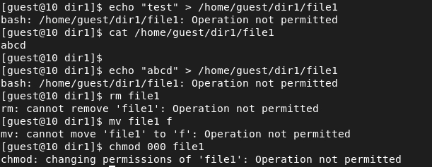
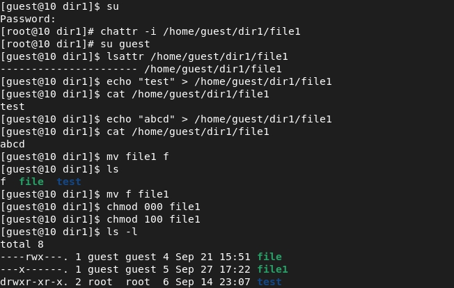

---
# Front matter
title: "Отчет по лабораторной работе №4"
subtitle: "Дискреционное разгарничение прав в Linux. Расширенные атрибуты"
author: "Бурдина Ксения Павловна"
group: NFIbd-01-19
institute: RUDN University, Moscow, Russian Federation
date: 2022 Sep 27th

# Generic otions
lang: ru-RU
toc-title: "Содержание"

# Pdf output format
toc: true # Table of contents
toc_depth: 2
lof: true # List of figures
fontsize: 12pt
linestretch: 1.5
papersize: a4
documentclass: scrreprt
### Fonts
mainfont: PT Serif
romanfont: PT Serif
sansfont: PT Sans
monofont: PT Mono
mainfontoptions: Ligatures=TeX
romanfontoptions: Ligatures=TeX
sansfontoptions: Ligatures=TeX,Scale=MatchLowercase
monofontoptions: Scale=MatchLowercase,Scale=0.9
## Biblatex
biblatex: true
biblio-style: "gost-numeric"
biblatexoptions:
  - parentracker=true
  - backend=biber
  - hyperref=auto
  - language=auto
  - autolang=other*
  - citestyle=gost-numeric
## Misc options
indent: true
header-includes:
  - \linepenalty=10 # the penalty added to the badness of each line within a paragraph (no associated penalty node) Increasing the value makes tex try to have fewer lines in the paragraph.
  - \interlinepenalty=0 # value of the penalty (node) added after each line of a paragraph.
  - \hyphenpenalty=50 # the penalty for line breaking at an automatically inserted hyphen
  - \exhyphenpenalty=50 # the penalty for line breaking at an explicit hyphen
  - \binoppenalty=700 # the penalty for breaking a line at a binary operator
  - \relpenalty=500 # the penalty for breaking a line at a relation
  - \clubpenalty=150 # extra penalty for breaking after first line of a paragraph
  - \widowpenalty=150 # extra penalty for breaking before last line of a paragraph
  - \displaywidowpenalty=50 # extra penalty for breaking before last line before a display math
  - \brokenpenalty=100 # extra penalty for page breaking after a hyphenated line
  - \predisplaypenalty=10000 # penalty for breaking before a display
  - \postdisplaypenalty=0 # penalty for breaking after a display
  - \floatingpenalty = 20000 # penalty for splitting an insertion (can only be split footnote in standard LaTeX)
  - \raggedbottom # or \flushbottom
  - \usepackage{float} # keep figures where there are in the text
  - \floatplacement{figure}{H} # keep figures where there are in the text
---

# Цель работы

Целью данной работы является получение практических навыков работы в консоли с расширенными атрибутами файлов.

# Ход выполнения лабораторной работы

1. От имени пользователя guest определим расширенные атрибуты файла /home/guest/dir1/file1:

2. Установим на файл file1 права, разрешающие чтение и запись для владельца файла:

3. Попробуем установить на файл /home/guest/dir1/file1 расширенный атрибут *a* от имени пользователя guest:

В ответ мы получили отказ от выполнения операции, поскольку у нас нет прав на выполнение файла, а соответственно и на изменение его атрибутов.

4. Повысим свои права с помощью команды su и попробуем установить расширенный атрибут *a* на файл /home/guest/dir1/file1 от имени суперпользователя:

5. От пользователя guest проверим правильность установления атрибута:

Видим, что наши расширенные атрибуты теперь имеют атрибут *a*.

6. Выполним дозапись в файл file1 слова «test», после чего выполним чтение файла file1:

Видим, что при выполнении дозаписи вывелась ошибка редактирования, а при проверке мы убедились, что файл остался пустым.

7. Попробуем удалить файл file1 либо стереть имеющуюся в нём информацию, а также переименовать наш файл:

Видим, что нам не удалось выполнить ни одного из этих действий.

8. Попробуем установить на файл file1 права, например, запрещающие чтение и запись для владельца файла:

Нам не удалось успешно выполнить указанные команды.

9. Теперь снимем расширенный атрибут *a* с файла от имени суперпользователя:

Проверим, что расширенных атрибутов на файл нет:

Повторим операции, которые нам не удавалось ранее [[1]](https://esystem.rudn.ru/pluginfile.php/1651887/mod_resource/content/3/004-lab_discret_extattr.pdf):

Видим, что теперь нам возможны и дозапись в файл, и его просмотр, и переименование файла file1, а также изменение атрибутов файла.

10. Повторим наши действия по шагам, заменив атрибут *a* атрибутом *i*.

Поставим от имени суперпользователя расширенный атрибут *i* и проверим правильность установки атрибута:

Теперь попробуем выполнить дозапись в файл file1 слова "test", его прочтение, изменение названия, удаление файла, а также смену атрибутов файла:

Видим, что у нас аналогично тому, как было с атрибутом *a*, имеется запрет на выполнение данных действий. Это происходит из-за того, что данные атрибуты запрещают пользователя удалять файл, изменять его содержимое, а также переименовывать [[2]](https://translated.turbopages.org/proxy_u/en-ru.ru.04fe409b-6333f962-77c5da5e-74722d776562/https/www.computerhope.com/unix/chattr.htm).

Соответственно, для продолжения работы с файлом нам необходимо снять данный атрибут и проверить, что нам действительно снова доступны все действия с файлом file1:

Видим, что у нас снова есть возможность выполнять все действия, описанные в лабораторной работе.

# Выводы

В ходе работы мы повысили свои навыки использования интерфейса командой строки (CLI), познакомились на примерах с тем, как используются основные и расширенные атрибуты при разграничении доступа. Имели возможность связать теорию дискреционного разделения доступа (дискреционная политика безопасности) с её реализацией на практике в ОС Linux. Опробовали действие на практике расширенных атрибутов *a* и *i*.

# Список литературы

1. Методические материалы курса [[1]](https://esystem.rudn.ru/pluginfile.php/1651887/mod_resource/content/3/004-lab_discret_extattr.pdf)
2. Электронный источник "Команды Linux chattr и lsattr" [[2]](https://translated.turbopages.org/proxy_u/en-ru.ru.04fe409b-6333f962-77c5da5e-74722d776562/https/www.computerhope.com/unix/chattr.htm)

